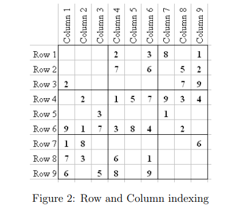

# Sudoku_solve
Solves a sudoku on a 9x9 input array in python
A Sudoku is a puzzle with 81 numbers which is the form of a 9×9 grid that is broken into rows,
columns and blocks with the constraint that each row, column and block has unique elements from 1 to
9 i.e. no row,column or block has a repeating element. Each cell has one number inside it and
there is only one valid solution for a Sudoku.

the representation of that Sudoku in python would be the following -
[[4,3,5,2,6,9,7,8,1],[6,8,2,5,7,1,4,9,3],[1,9,7,8,3,4,...],...]

FUNCTIONS:
1. get_block_num(sudoku:List[List[int]], pos:Tuple[int, int]) -> int:
This function takes two parameters position and sudoku and returns the block number of the
block which contains the position.
For example- If the position given is (4,6) then we return 5 as (4,6) is present in block
number 5. (See fig. 2 and 3 for indexing reference). For the input (1,1) the returned value is 1,
for (3,5) the returned value is 2 and for (1,4) the block is 2. Remember that the position is
4
defined as (row,column) and indexing starts from 1.

2. get_position_inside_block(sudoku:List[List[int]], pos:Tuple[int, int]) -> int
This function takes two parameters position and sudoku and will return the index of the position
inside the corresponding block.
For example, If the position is given as (4,6) then we return 3 as (4,6) position is at
the index 3 of the block 5 (See fig 2, 3 and 4 for indexing reference). For position (1,1)
the returned value is 1 as its at the 1
st place in the 1
st block, similarly (1,2) will return
2 and (1,3) will return 3. Note that (1,4) will again return 1 as its at the 1
st position of
the 2nd block. Remember that the position is defined as (row,column) and indexing starts from 1.
Dependencies: get_block_num()

3. get_block(sudoku:List[List[int]], x: int) -> List[int]:
This function takes an integer argument i and then returns the i
th block of the Sudoku. See fig. 1
for block indexing. Note that block indexing is from 1 to 9 and not 0-8 thus the input x will be
from 1 to 9.
For example If we call get_block(4) in figure 6 after solving Sudoku then it will return
[8, 5, 9, 4, 2, 6, 7, 1, 3] as it is the 4
th block of the Sudoku.

4. get_row(sudoku:List[List[int]], x: int) -> List[int]:
This function takes an integer argument i and then returns the i
th row. Row indexing have been
shown above. Note that row indexing is from 1 to 9 and not 0-8 thus the input x will be from 1 to 9.
For example If we call get_row(4) on solved Sudoku of figure 6 then it will return [8, 5, 9, 7, 6, 1, 4, 2, 3]
as it the 4
th row of the solved Sudoku

5. get_column(sudoku:List[List[int]], x: int) -> List[int]:
This function takes an integer argument i and then returns the i
th column. Column indexing have
been shown above. Note that block indexing is from 1-9 and not 0-8 thus the input x will be
from 1 to 9.
For example if we call get_column(4) in figure 6 after solving Sudoku then it will return
[6, 1, 3, 7, 8, 9, 5, 4, 2] as it is the 4
th column of the Sudoku.

6. find_first_unassigned_position(sudoku : List[List[int]]) -> Tuple[int, int]:
This function returns the first empty position in the Sudoku. If there are more than 1 position
which is empty then position with lesser row number should be returned. If two empty positions
5
have same row number then the position with less column number is to be returned. If the Sudoku
is completely filled then return (-1,-1). The returned value is the position thus will be a tuple
of integers and will be equal to (row,column)
For example, when called on the Sudoku in fig. 5 will return (1,3)

7. valid_list(lst: List[int])->bool:
This function takes a lists as an input and returns true if the given list is valid. The list will be a
single block , single row or single column only. A valid list is defined as a list in which all non
empty elements doesn’t have a repeating element.
Note: A list may be valid even though it doesn’t satisfy the Sudoku or be completely filled. You
just have to check whether the provided list have repetitive non-empty elements or not. If the
list is valid and Sudoku is violated then also you have to return true. Also note that 0 can be
present any number of times as the cell containing 0 is empty. You are NOT allowed to use
dictionaries or hash-maps in this question.
For example: Valid list when called on [1,2,3,0,0,1,7,5,0] will return False due to
repeating number 1. Whereas when called on [5,3,0,0,7,0,0,0,0] will return True

8. valid_Sudoku(sudoku:List[List[int]])->bool:
This function returns True if the whole Sudoku is valid. You will have to check whether each
row, column and block has unique non-empty elements. As in the valid_list() the Sudoku
may have multiple 0s as they just indicate an empty position.
Dependencies: valid_list()

9. get_candidates(sudoku:List[List[int]], pos:Tuple[int, int]) -> List[int]:
This function takes the Sudoku and s position as arguments and returns a list of all the possible
values that can be assigned at that position so that the Sudoku remains valid at that instant.
What this means is that say the block which has this position has the number 5 then 5 is not a
candidate. If the number 3 does not appear in the row, column or block of the position it is a
valid candidate.
Dependencies: get_row(), get_column() and get_block()

10. make_move(sudoku:List[List[int]], pos:Tuple[int, int], num:int) -> List[List[int]]:
It takes the Sudoku, a position and a number as a parameter and returns the Sudoku after placing
the number at the position.

11. undo_move(sudoku:List[List[int]], pos:Tuple[int, int]):
This function fills 0 at position pos in the Sudoku and then returns the modified Sudoku. It will
6
undo the move done and make the position empty again.

12. sudoku_solver(sudoku: List[List[int]]) -> Tuple[bool, List[List[int]]]::
This is the main Sudoku solver. This function solves the given incomplete Sudoku and returns
true if a Sudoku can be solved i.e. after filling all the empty positions the Sudoku remains valid
and also returns the solved Sudoku.
Algorithm 1 Solve Sudoku
Require: sudoku : List[List[int]]
>>while Unassigned position exists do
>>Get the candidates at that position
>>for Each candidate do
>>Make move
>>Recursively solve for the Sudoku after making move
>>if Sudoku not solved then
>>Undo Move
>>end if
>>end for
>>end while

Dependencies: get_candidates(), find_first_unassigned_position(), make_move(), undo_move()
